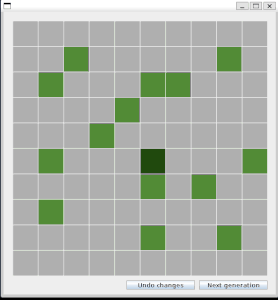
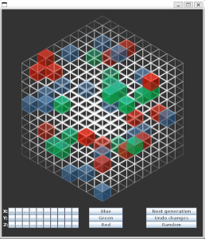

# Game of Life - Java Implementation

[](https://www.oracle.com/java/)
[](https://docs.oracle.com/javase/tutorial/uiswing/)
[](https://refactoring.guru/design-patterns)
[](LICENSE)
[](https://www.java.com/)

A comprehensive Java implementation of Conway's Game of Life with both 2D and 3D versions, featuring multiple game rules, GUI interface, and interactive gameplay.

 


## 🎮 Features

- **2D and 3D Versions**: Complete implementations with different visual representations
- **Multiple Game Rules**: Standard Conway's rules, HighLife, Immigration Game, and custom generic rules
- **Interactive GUI**: Swing-based graphical interface with clickable cells
- **Console Interface**: Text-based gameplay option
- **Undo/Redo Functionality**: Memento pattern implementation for state management
- **Statistics Tracking**: Monitor cell births, deaths, and influences
- **Custom Cell States**: Support for multiple alive cell types with different behaviors
- **Flexible Architecture**: Extensible design patterns for easy rule modifications

## 🔧 Requirements

- **Java**: JDK 8 or higher
- **Operating System**: Windows, macOS, or Linux
- **Memory**: Minimum 256MB RAM
- **Display**: GUI version requires graphical display

## 🚀 Quick Start

### Option 1: Using Makefile (Recommended)
```bash
# Compile and run 2D version
make run-2d

# Compile and run 3D version
make run-3d

# Clean compiled files
make clean
```

### Option 2: Manual Compilation

#### 2D Version
```bash
# Navigate to 2D project directory
cd GameOfLife

# Compile
javac -d bin -cp src src/br/unb/cic/lp/gol/*.java src/br/unb/cic/lp/rules/*.java src/br/unb/cic/lp/states/*.java src/br/unb/cic/lp/savedStates/*.java

# Run
java -cp bin br.unb.cic.lp.gol.Main
```

#### 3D Version
```bash
# Navigate to 3D project directory
cd GameOfLife3D

# Compile
javac -d bin -cp src src/br/unb/cic/lp/gol/*.java src/br/unb/cic/lp/rules/*.java src/br/unb/cic/lp/states/*.java src/br/unb/cic/lp/savedStates/*.java

# Run
java -cp bin br.unb.cic.lp.gol.Main
```

## 📁 Project Structure

```
GameofLife/
├── GameOfLife/                 # 2D Version
│   ├── src/
│   │   └── br/unb/cic/lp/
│   │       ├── gol/           # Core game logic
│   │       ├── rules/         # Game rule implementations
│   │       ├── states/        # Cell state definitions
│   │       └── savedStates/   # Memento pattern for undo/redo
│   ├── resources/             # Image assets
│   └── bin/                   # Compiled classes
├── GameOfLife3D/              # 3D Version
│   ├── src/                   # Same structure as 2D
│   ├── resources/             # 3D-specific assets
│   └── bin/                   # Compiled classes
├── README.md                  # This file
├── Makefile                   # Build automation
├── build.sh                   # Linux/macOS build script
├── build.bat                  # Windows build script
└── .gitignore                 # Git ignore patterns
```

## 🎲 Game Rules

### Standard Conway's Rules
- **Survival**: Live cells with 2-3 neighbors survive
- **Birth**: Dead cells with exactly 3 neighbors become alive
- **Death**: All other cells die

### HighLife Rules
- **Survival**: Live cells with 2-3 neighbors survive
- **Birth**: Dead cells with 3 or 6 neighbors become alive

### Immigration Game
- **Multiple Cell Types**: Two different alive cell states
- **Survival**: Based on total neighbor count
- **Birth**: New cells take the majority neighbor type

### Generic Rules (3D Version)
- **Configurable**: Custom survival and birth conditions
- **Multiple States**: Support for multiple alive cell types
- **Flexible**: Easy to modify and extend

## 🎮 How to Play

### GUI Version
1. **Click cells** to toggle their state (dead/alive)
2. **Next Generation** button to advance the simulation
3. **Undo** button to revert changes
4. **Close window** to exit

### Console Version
1. **Option 1**: Make a cell alive (specify row/column)
2. **Option 2**: Advance to next generation
3. **Option 3**: Exit and view statistics
4. **Option 4**: Undo last change (if available)

## 🏗️ Architecture

The project follows several design patterns:

- **Facade Pattern**: `Game` class simplifies game creation
- **Strategy Pattern**: `GameRule` interface for different rule implementations
- **State Pattern**: `CellState` hierarchy for different cell types
- **Memento Pattern**: `Memento` and `Caretaker` for undo functionality
- **Observer Pattern**: `CellListener` for cell state changes
- **MVC Pattern**: Separation of game logic, view, and controller

## 🔧 Development

### Adding New Game Rules
1. Implement `GameRule` interface
2. Define survival and birth conditions
3. Add to `Main` class for testing

### Adding New Cell States
1. Extend `CellState` abstract class
2. Define visual representation
3. Update rule logic accordingly

### Building from Source
```bash
# Clone the repository
git clone <repository-url>
cd GameofLife

# Build using provided scripts
./build.sh    # Linux/macOS
build.bat     # Windows

# Or use Makefile
make all
```